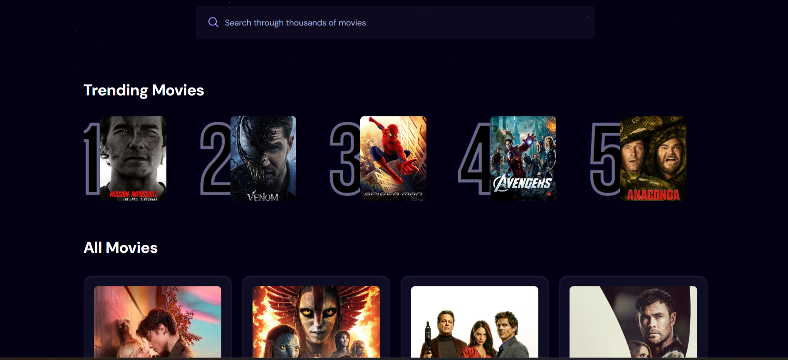
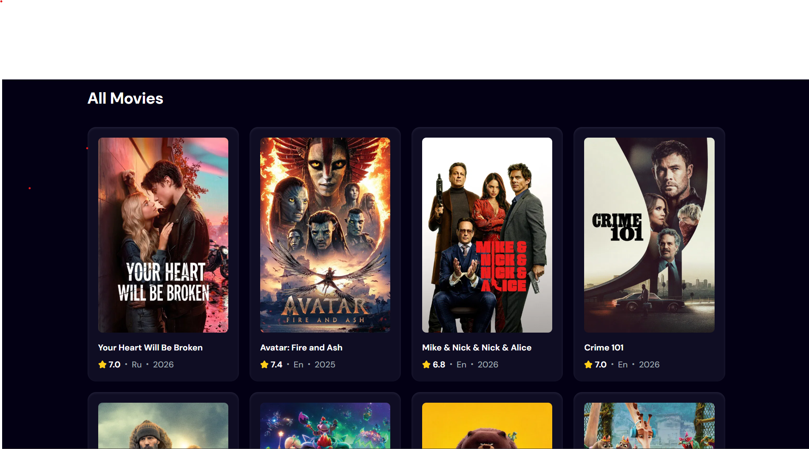

# KDR Movies

Is a react application which allows users to browse movies and search for movie titles

---

## Live Demo

https://auzair-17.github.io/kdr-movies/

---

## Screenshots





---

## Features

- Browse popular movies
- Search movies
- Trending algorithm, for most searched movies
- Clean and responsive UI

---

## Technologies Used

- ReactJS
- Appwrite
- TMDB API
- JavaScript
- Tailwind CSS
- HTML & CSS

---

## Installation

### Step 1: Clone the repository

```bash
git clone https://github.com/auzair-17/kdr-movies.git
```

### Step 2: Go to project directory

```bash
cd kdr-movies
```

### Step 3: Install dependencies

```bash
npm install
```

### Step 4: Start development server

```bash
npm run dev
```

## Author

**Auzair**

- Github: https://github.com/auzair-17
